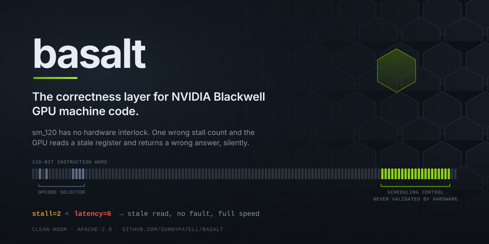

<div align="center">



<br/>


<a href="https://github.com/sunnypatell/basalt/actions/workflows/ci.yml"></a>
<a href="LICENSE"></a>


<br/><br/>

<strong><a href="#the-problem">The problem</a> &nbsp;&middot;&nbsp; <a href="#how-it-works">How it works</a> &nbsp;&middot;&nbsp; <a href="#quickstart">Quickstart</a> &nbsp;&middot;&nbsp; <a href="#measured-not-assumed">Measured, not assumed</a> &nbsp;&middot;&nbsp; <a href="docs/FINDINGS.md">Findings</a> &nbsp;&middot;&nbsp; <a href="docs/METHOD.md">Method</a> &nbsp;&middot;&nbsp; <a href="docs/ROADMAP.md">Roadmap</a> &nbsp;&middot;&nbsp; <a href="#clean-room-position">Clean-room</a></strong>

</div>

---

## The problem

An NVIDIA GPU instruction is 128 bits, and about 23 of them are not the instruction at all. They are a scheduling control word: how many cycles to stall before issuing the next instruction, which scoreboards to signal, which to wait on, and which operands may be served from the reuse cache.

**The hardware does not check any of it.** On sm_120 there is no interlock on fixed-latency instructions. The silicon trusts whatever produced the control word. If a stall count is shorter than the latency of a value the next instruction consumes, nothing faults, nothing stalls, and no warning is emitted. The instruction reads a register that has not been written yet and computes on stale data, at full speed, every single time.

That is a strange kind of bug. It does not crash. It does not appear in a debugger. It produces numbers that are merely wrong, which in a matrix multiply or an attention kernel means a model that trains slightly badly rather than one that visibly breaks.

Tools that generate machine code for this architecture *assign* those control bits from a latency model. basalt is the thing that checks the answer.

## The first one that checks somebody else's work

Machine-code assemblers for NVIDIA GPUs have existed for a decade, and there is prior work
on Blackwell specifically: the encoding has been reverse engineered before, there are
published cycle-level characterisations of `sm_120`, and there are tools that generate its
scheduling control bits and run their own kernels on a real card to see that the answers
come out right. Being first to write one is not the claim here, and neither is being first
to run one.

Being first to **check code you did not write** is.

Generating a kernel and confirming it computes the right answer is a real control, and it
is a different question. It says nothing about the cubin in front of you, because it did
not produce that cubin. There is no tool that reads `sm_120` machine code, whatever emitted
it, and tells you whether its control bits actually cover its data dependencies, which on
an architecture with no hardware interlock is the difference between "it ran" and "it is
correct": a wrong stall count produces a wrong number at full speed, with no fault and no
warning.

basalt reads a cubin and answers that question. The reference it is held to is the vendor
compiler's own output, so a disagreement is basalt's bug until proven otherwise, and the
schedules it writes itself have to reproduce what the vendor's schedules compute, byte for
byte, on the card.

So basalt is three tools, each held to the same standard, and the standard is the point:
**agree with the vendor exactly, or say why not.**

| | What it does | How it is checked | Result |
| :--- | :--- | :--- | ---: |
| **Assembler** | SASS text to the 128-bit word | Reassemble every instruction `ptxas` emitted and compare bytes | 8,540 of 8,584 exact, **0 wrong** |
| **Checker** | Reads a schedule, reports hazards | The vendor's own output must verify clean, and a deliberately shortened stall must be caught | 0 errors on 330 vendor kernels, **0 missed** on 162 broken ones |
| **Scheduler** | Assigns the control bits from scratch | Discard every control bit, compute new ones, run both on the GPU against four inputs, compare output bytes | **314 of 314** byte-identical, at every optimisation level |

And the part a scheduler is usually quiet about: what the correctness costs. basalt's
schedules spend **0.90x** the vendor's issue cycles, slower on 34 of the 330 kernels and
cheaper on the rest, with every comparable kernel still byte-identical on the GPU.

Cheaper than the vendor is not a claim to be smug about. basalt schedules every dependency
at the tightest gap `ptxas` was ever seen to leave for that exact pairing, and `ptxas` is
balancing register pressure and memory alongside issue latency while this optimises one
number. It was also not believed on sight: the first time the ratio went under 1.0 the
hardware round trip broke, and the number only stood once the bug it exposed was fixed. The
ratio is pinned from both sides in the test suite for that reason.

The middle column is the point. A checker and a scheduler that share a latency model agree
with each other while both being wrong, so neither is evidence for the other; only the
silicon has no stake in the argument. Running the scheduler over seven hand-written kernels
passed seven of seven for a long time. Running it over three hundred found forty-one wrong
ones, and every correction in [findings](docs/FINDINGS.md) came out of watching that number
move.

The same applies to the inputs. A stale read only changes the answer when the stale value
and the fresh one differ, so one pattern of bytes is one chance to notice, and running
every kernel against a second, third and fourth pattern immediately found a carry-out
predicate the operand model had been reading as a source since the beginning. It had
survived every control up to that point, including the round trip itself.

The same discipline decides what the assembler is allowed to do. It reached 99% of the
corpus only after six separate rounds of being confidently incorrect:

- writing a register number into the encoding of an immediate form,
- treating a uniform register as interchangeable with a regular one,
- keeping the branch target of whichever kernel the form was harvested from,
- putting the integer 15 into a field that holds a half-precision float,
- writing an operand into bits that turned out to be a reuse flag,
- and writing into a field the prober had only partly attributed, leaving the rest still
  encoding the old value.

Every one of those produced a word that assembles, disassembles back to exactly the text
it came from, and computes something else. That is the same failure the rest of this
repository exists to catch, which is why all six are now refused with a reason naming what
the field really holds, and why the count of instructions that assemble to the wrong bytes
is a test pinned at zero rather than a number in a table.

## How it works

Everything rests on two oracles, both of which are stock NVIDIA binaries driven as external processes. No NVIDIA source, headers, or libraries are used or redistributed.

| Oracle | Invocation | What it gives |
| :--- | :--- | :--- |
| **Ground truth** | `ptxas` → cubin → `nvdisasm -c -hex` | Encodings the vendor compiler actually emits. Semantics beyond dispute. |
| **Probe** | `nvdisasm -b SM120a` over raw bytes | Decodes words `ptxas` will never emit, which turns the encoding space into something searchable rather than something to guess at. |

The probe oracle is the one that matters. A tool limited to compiler output can only ever rediscover what the compiler already does. Feeding synthesised 128-bit words straight to the decoder means the instruction set can be *measured*.

Neither oracle needs a GPU, so the entire instruction database rebuilds in CI on any machine.

### Deriving the encoding by changing it

basalt does not read a table of opcodes from anywhere. It takes an encoding that assembled, flips one bit, decodes the result, and records what moved. A bit that changes the destination register is a destination bit; a bit that changes the mnemonic is a selector; a bit that changes nothing observable is inert.

Run against `IADD R5, R5, 0x2a`, the measurement comes out as:

```
operand[0]  bits 16:23     flip 16 -> R4,  flip 17 -> R7      destination register
operand[1]  bits 24:31     plus bit 72, which negates it      source register
operand[2]  bits 32:63     flip 32 -> 0x2b, flip 33 -> 0x28   32-bit immediate
opcode      bits 2, 4, 12:15
inert       36 bits        no observable effect
invalid     11 bits        the decoder rejects the mutation
```

Eight-bit register fields and a 32-bit immediate, arrived at by experiment rather than assumption.

### The control word

| Field | Bits | Meaning |
| :--- | :--- | :--- |
| `stall` | 108:105 | Cycles to wait before issuing the next instruction |
| `yield` | 109 | Hint that the warp scheduler may switch warps |
| `write_barrier` | 112:110 | Scoreboard to signal on write-back (7 = none) |
| `read_barrier` | 115:113 | Scoreboard to signal on operand read (7 = none) |
| `wait_mask` | 121:116 | Scoreboards that must be clear before issuing |
| `reuse` | 125:122 | Operand reuse-cache flags, one per source slot |

The layout validates itself on contact. In a trivial kernel, `S2R` sets `write_barrier=0` and the `IMAD` consuming its result carries `wait_mask=0x01`; `LDCU.64` sets `write_barrier=1` and the dependent `STG.E` carries `wait_mask=0x02`. Every producer and consumer pair lines up, and instructions that `nvdisasm` annotates `.reuse` have the matching reuse bit set.

## Which GPUs, and what needs one

<div align="center">


</div>

`sm_120` is not a model number. It is the compute capability shared by the whole consumer
Blackwell line, so the instruction encoding, the database, the assembler and the checker
apply to every card in it:

| Card | Compute capability | Covered |
| :--- | :--- | :---: |
| GeForce RTX 5090, 5090D | 12.0 (`sm_120`) | yes |
| GeForce RTX 5080, 5070 Ti, 5070 | 12.0 (`sm_120`) | yes |
| GeForce RTX 5060 Ti, 5060, 5050 | 12.0 (`sm_120`) | yes |
| GeForce RTX 50 series laptop parts | 12.0 (`sm_120`) | yes |
| RTX PRO Blackwell workstation cards | 12.0 (`sm_120`) | yes |
| Datacentre Blackwell (B100, B200, GB200) | 10.0 (`sm_100`) | no, different encoding |

### The card everything was measured on

Every number in this repository comes from one physical card, and it is named exactly
because "a 5070 Ti" is not enough to reproduce a run:

| | |
| :--- | :--- |
| Board | Gigabyte GeForce RTX 5070 Ti **EAGLE OC** |
| Reported by the driver | `NVIDIA GeForce RTX 5070 Ti` |
| Compute capability | 12.0 |
| Streaming multiprocessors | 70 |
| Boost clock | 2542 MHz |
| Toolchain | CUDA 13.3.1, `ptxas` V13.3.73 |

The factory overclock does not move the measurements. Every latency here is in **cycles**,
which is a property of the pipeline rather than of the clock, and the boost figure is
recorded beside them only so a wall-clock comparison stays possible. What the board does
affect is reproducibility, which is why `basalt measure --board` records it.

**Most of basalt needs no GPU at all.** Both oracles, the instruction database, the
assembler and the hazard checker run against `ptxas` and `nvdisasm` as ordinary
subprocesses, which is why they run in CI on a machine with no graphics card in it. 187 of
the 202 tests are in that group.

A GPU is needed for exactly two things, and they are the two that turn a plausible tool
into a believable one:

| Needs a card | Why |
| :--- | :--- |
| `measure`, `probe-stalls` | Timing an instruction, and finding what a dependency really requires by breaking it |
| `scripts/roundtrip_corpus.py` | Rescheduling every corpus kernel and running both versions to compare output bytes |

### About the numbers

Everything measured here was measured on one card, an RTX 5070 Ti, and basalt records the
SKU alongside every measurement rather than presenting them as universal. A 5090 has more
than twice the SMs and its own clock behaviour; the encoding will be identical and the
latencies should be re-measured rather than assumed:

```bash
python -m basalt.cli measure -o data/latency/your-card.json
python -m basalt.cli verify kernel.cubin --latencies data/latency/your-card.json
```

That is not a caveat added for modesty. A latency model shared between a checker and a
scheduler is exactly where a wrong number hides, so a second card is the most useful thing
anyone can contribute.

## Quickstart

No CUDA installation and no GPU. The toolchain script fetches pinned redistributables, roughly 45 MB, no administrator rights, nothing added to your PATH.

```bash
git clone https://github.com/sunnypatell/basalt.git
cd basalt
python -m venv .venv && source .venv/bin/activate   # Windows: .\.venv\Scripts\Activate.ps1
pip install -e ".[dev]"

python scripts/fetch_toolchain.py     # pinned ptxas + nvdisasm
python -m basalt.cli doctor           # verify both oracles end to end
```

```console
$ python -m basalt.cli doctor
ok    toolchain   V13.3.73 in third_party/cuda/13.3.1/bin
ok    ptxas       assembled sm_120a
ok    cubin oracle  16 instructions with encodings
ok    probe oracle 16/16 mnemonics round-tripped

both oracles healthy. no GPU required for anything above.
```

Rebuild the instruction database from scratch, or query the committed one:

```bash
python -m basalt.cli build-isa          # harvest, probe, write data/isa/sm_120a.json
python -m basalt.cli isa --stats
python -m basalt.cli isa IMAD.WIDE.U32  # one form, with its measured field layout
python -m basalt.cli isa --opcode QMMA  # every form of one opcode
```

Then check a cubin, whatever produced it:

```bash
python -m basalt.cli measure -o data/latency/your-card.json   # needs a GPU, once
python -m basalt.cli verify kernel.cubin --latencies data/latency/your-card.json
```

Everything else, in one place:

| Command | What it does | Needs a GPU |
| :--- | :--- | :--- |
| `doctor` | Check both oracles end to end | no |
| `build-isa` | Harvest and probe, write the instruction database | no |
| `isa` | Query a form, an opcode, or the coverage | no |
| `validate-isa` | Prove the measured fields can be written through | no |
| `mine-stalls` | Learn per-pair requirements from what the compiler schedules | no |
| `verify` | Check a cubin's control bits for data hazards | no |
| `schedule` | Assign a cubin's control bits from scratch and check the result | no |
| `assemble` | Encode SASS text, or a whole cubin, and read it back to prove it | no |
| `measure` | Time instruction latency on real silicon | **yes** |
| `probe-stalls` | Find the required stall by breaking programs on purpose | **yes** |

And the control that keeps the rest honest, which does need a card:

```bash
python scripts/roundtrip_corpus.py    # reschedule all 330 corpus kernels, run both on the GPU
```

```console
$ python -m basalt.cli verify kernel.cubin --latencies data/latency/rtx-5070-ti.json
kernel.cubin
  32 instructions in 3 blocks, 23 dependencies checked: clean
  latency model: measured on NVIDIA GeForce RTX 5070 Ti
```

## Measured, not assumed

Numbers here are printed by the tooling and regenerate from a clean checkout. The commands above are the source of truth; these tables are snapshots.

**Instruction database.** Every entry carries an encoding that really assembled and the compiler build that produced it.

| | |
| :--- | ---: |
| Instruction forms | 274 |
| Distinct opcodes | 77 |
| Forms with a full operand map | 269 |
| Tensor-core forms | 43 |
| Built with | `ptxas` V13.3.73 |

Tensor coverage is where the low-precision hardware lives: `HMMA` and `IMMA`, `QMMA` across the FP8, FP6 and FP4 types including asymmetric operand pairs, the scale-factor forms `QMMA.SF` and `OMMA.SF` that carry a per-block exponent, sparse `IMMA.SP`, and the matrix movement instructions `LDSM`, `STSM` and `MOVM` in every shape including the transposing variants.

**Latency, on an RTX 5070 Ti.** 70 SMs, every fit R² ≥ 0.9998. Measured by timing dependent chains and taking the slope, with the chain length read back out of the compiled SASS rather than assumed.

| Instructions | Cycles |
| :--- | ---: |
| `IMAD` `IADD3` `FFMA` `FADD` `FMUL` `LOP3` `SHF` | 4 |
| `POPC` | 18 |
| `I2FP` + `F2I` together | 24 |
| `MUFU` | 44 |
| `DADD` `DFMA` | 64 |

Three of those contradict the assumed model basalt shipped with: `DADD` was assumed 48, `POPC` was assumed 4, and each conversion was assumed 6 against 24 measured for the round trip. An assumed latency model is not a small approximation of a measured one, which is the entire argument for measuring.

**And a stall of zero is not zero cycles.** It is a distinct safe encoding that waits for outstanding results, costing about 37 cycles where a scheduled instruction costs 4. That is why `ptxas -O0` emits an entirely zeroed control word and the code still computes correctly, roughly nine times slower.

| `stall` | cycles/instruction | result |
| ---: | ---: | :--- |
| **0** | **36.85** | **correct** |
| 1 | 4.88 | wrong |
| 2 | 4.88 | wrong |
| 3 | 5.88 | wrong |
| 4 | 6.88 | correct |

**It agrees with the vendor compiler on every kernel in the corpus.** Every kernel `ptxas` builds from the corpus is verified against its own scheduling: 6,165 dependencies, zero errors. That sweep runs in CI on every push, and every modelling error this project has made was caught by it rather than by reasoning.

**The verdicts match the silicon.** For every encodable stall on a dependent producer, basalt's static answer and what the hardware actually computes agree, including the zero case. That is held as a test, not asserted here. Full evidence, including three independent methods for the required stall and the corrections made along the way, is in [findings](docs/FINDINGS.md).

**And when it says a schedule is unsafe, the silicon agrees.** Take the vendor's own working schedule for 162 kernels, shorten one real dependency in each, and compare basalt's verdict against what the GPU computes: 91 that it called broken were broken, and **nothing it called safe computed a wrong answer**. That number started at 34 missed rather than zero, and [findings](docs/FINDINGS.md) says what the cause was and what fixing it cost in false alarms, because a sweep that only ever reported its final figure would be worth less than one that reported its first.

## It can assign the control bits too

The verifier answers whether a schedule is safe. The scheduler answers what a safe schedule would be, from the same measurements: it discards every control bit `ptxas` produced, computes its own, hands the result back to the verifier, and then runs it on the GPU beside the vendor's version of the same kernel.

Run over the whole corpus on the card, at every optimisation level that produces a schedule, every one of the 314 comparable kernels comes out computing byte-identical results to the vendor schedule, from control bits basalt worked out itself. The 16 that are excluded are excluded for reasons that have nothing to do with the schedule, and [findings](docs/FINDINGS.md) says which and why rather than folding them into a percentage.

That control is the reason any of the rest is trustworthy. The checker and the scheduler read the same latency model, so a wrong entry in it satisfies both at once and they agree with each other while both being wrong. Only the silicon has no stake in the argument. Running the scheduler over seven hand-written kernels passed seven of seven for a long time; running it over three hundred found forty-one wrong ones, and every model correction since came out of watching that number move.

That loop is where the real bugs came from. Stall spent outside the window between a producer and its consumer counts for nothing, and spending it there ends the search with a program that is still short. A stall pinned to the safe encoding was being overwritten by a later pass, replacing a guarantee with a small number. fp64 operands occupy register pairs with nothing in the mnemonic to say so, so half of every fp64 dependency was invisible to both the checker and the scheduler. A predicate used as an instruction's guard needs thirteen cycles where the same predicate read as data needs five, because a guard has to be resolved before the instruction issues at all. And waiting on a scoreboard does not settle a dependency completely: the producer still owes a small stall of its own, two cycles for fp64 add, and one cycle less is silently wrong. None of those were found by reasoning; every one was found by running the output and getting the wrong number.

> [!NOTE]
> **Alpha, and specific about what that means.** What is done: both oracles, the instruction database with its fields proven writable, the hazard checker over a real control-flow graph, latency measured on one SKU by three independent methods, and a scheduler that round-trips every comparable corpus kernel through the hardware byte-for-byte. What is not: 16 corpus kernels this harness cannot compare at all, named in the findings; many opcodes still carry assumed latencies rather than measured ones; and only one GPU has been measured. Where something is inferred rather than measured, the tooling says so rather than rounding it up to a fact. See the [roadmap](docs/ROADMAP.md) and the [method](docs/METHOD.md).

## Repository layout

```
src/basalt/
  toolchain.py     Locating and driving ptxas / nvdisasm
  encoding.py      The 128-bit instruction word and its control fields
  disasm.py        Both oracles: cubin ground truth and raw-word probe
  harvest/         PTX corpus generation and encoding extraction
  probe/           Differential bit probing and field inference
  isa/             The generated instruction database and its builder
  asm/             The assembler, and the ELF reader that rewrites words in place
  sched/           Assigning the control bits, and costing the result
  verify/          Register def-use analysis, hazard model, latency checking
  gpu/             Driver-API bindings and the latency measurement harness
data/isa/          Generated database, tracked so consumers need no harvest
data/latency/      Measured latency and mined stalls, one file per GPU
docs/              Findings, method, roadmap, artwork sources
scripts/           Toolchain fetch, asset rendering, drift check, and the two
                   hardware controls: the corpus round trip and the agreement sweep
tests/             Unit tests, plus toolchain- and GPU-marked suites
```

## Clean-room position

basalt is an independent, clean-room work for interoperability. It contains no NVIDIA source code, headers, libraries, or documentation, and redistributes none. It observes the behaviour of publicly distributed executables and records it, which is the footing this kind of work has stood on for over a decade.

NVIDIA, CUDA, and Blackwell are trademarks of NVIDIA Corporation. This project is not affiliated with, endorsed by, or sponsored by NVIDIA.

Licensed under [Apache-2.0](LICENSE). Apache rather than something restrictive on purpose: a correctness tool nobody is allowed to build on is a correctness tool nobody runs, and the patent grant matters for work this close to hardware.

## Contributing

The highest-value contribution is an encoding basalt gets wrong. See [`CONTRIBUTING.md`](CONTRIBUTING.md) and the [ISA gap template](.github/ISSUE_TEMPLATE/isa_gap.yml), which collects enough to reproduce without your machine.

## Author

**Sunny Patel** &middot; [sunnypatel.net](https://www.sunnypatel.net) &middot; [ORCID 0009-0005-3863-7642](https://orcid.org/0009-0005-3863-7642) &middot; [github.com/sunnypatell](https://github.com/sunnypatell)
