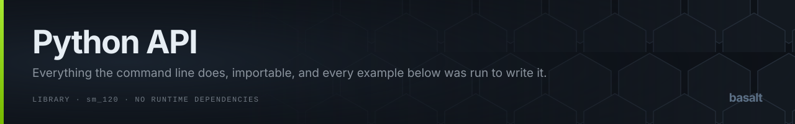

`python -m basalt.cli` is a thin wrapper. Everything it does is importable, the package has no
runtime dependencies, and all three measured tables ship inside it, so an installed copy is a
complete one.

Every code block on this page was executed to write it, and the output beneath each is what it
printed rather than what it ought to print.

## What needs what

Only disassembly shells out. `ptxas` and `nvdisasm` turn a cubin into a `Program`; once you
have one, the checker, the scheduler and the assembler are pure Python over committed data.

| You want to | Needs `ptxas`/`nvdisasm` | Needs a GPU |
| :--- | :---: | :---: |
| Query the instruction database | no | no |
| Check a `Program` for hazards | no | no |
| Schedule a `Program` | no | no |
| Assemble SASS text to a word | no | no |
| Turn a `.cubin` into a `Program` | **yes** | no |
| Measure latency, inject a fault | yes | **yes** |

Where the binaries are looked for is in the [README](https://github.com/sunnypatell/basalt#where-it-looks-for-ptxas-and-nvdisasm).
Any CUDA 13 install will do.

## Checking a cubin

The whole point of the project, in nine lines. `disassemble_kernels` returns one `Program` per
kernel because a library ELF holds hundreds and offsets restart at zero in each.

```python
from pathlib import Path

from basalt.disasm import disassemble_kernels
from basalt.paths import LATENCIES, OBSERVED_STALLS
from basalt.toolchain import find_toolchain
from basalt.verify.hazards import Severity, verify_program
from basalt.verify.latency import LatencyModel
from basalt.verify.observed import ObservedStalls

tc = find_toolchain()
model = LatencyModel.assumed().overlay(LATENCIES)
observed = ObservedStalls.read(OBSERVED_STALLS)

for name, program in disassemble_kernels(tc, Path("demo.cubin")).items():
    report = verify_program(program, model, observed)
    errors = [h for h in report.hazards if h.severity is Severity.ERROR]
    print(name, report.instructions, report.checked_pairs, len(errors))
```

```console
demo: 24 instructions, 11 dependencies, 0 errors
model measured on: NVIDIA GeForce RTX 5070 Ti
fully analysed: True
```

`observed` is optional and you want it. Without the mined table the checker falls back to the
latency model alone, which is correct but blunter: a per-pair requirement measured across
24,311 vendor kernels is what lets it distinguish a tight schedule from a wrong one.

### What a report holds

| Field | Meaning |
| :--- | :--- |
| `hazards` | `list[Hazard]`, in program order |
| `instructions`, `blocks`, `checked_pairs` | what was actually examined |
| `model_confidence`, `model_sku` | where the numbers came from, and which card |
| `unknown_opcodes` | opcodes the model has never seen, checked against a guess |
| `cross_block` | whether dataflow followed edges rather than stopping at blocks |
| `incomplete_graph` | **true means part of the kernel was not reached** |

That last field is the one to assert on. A checker that quietly skipped a tenth of a kernel
reports the same zero errors as one that read all of it.

## Reading a hazard

Shortening every stall to 1 is the cheapest way to make a working kernel unsafe:

```python
import dataclasses
from basalt.verify.hazards import verify_program

broken = [
    dataclasses.replace(i, word=i.word.with_field("stall", 1)) if i.word else i
    for i in program.instructions
]
report = verify_program(dataclasses.replace(program, instructions=broken), model, observed)

for hazard in report.hazards[:2]:
    print(hazard.severity.value, hazard.kind.name, hazard.register)
    print(" needs", hazard.required, "cycles, has", hazard.actual)
    print(" ", hazard.def_text.strip())
    print(" ", hazard.use_text.strip())
```

```console
error: UNDERSTALLED on
  needs 2 cycles, has 1
  LDC.64 R2, c[0x0][0x380]
  LDG.E R0, desc[UR4][R2.64]
error: UNDERSTALLED on R5
  needs 3 cycles, has 1
  HFMA2 R5, -RZ, RZ, 0, 1.78813934326171875e-07
  IMAD R5, R0, R5, 0x7
```

`HazardKind` is one of `UNDERSTALLED`, `NO_BARRIER_SET`, `BARRIER_NOT_AWAITED` or
`OVERWRITTEN_BEFORE_READ`. `Severity` is `ERROR`, `WARNING` or `INFO`, and the split is not
cosmetic: **only a requirement grounded in something measured on silicon may be an error.** A
figure with no measurement behind it produces a warning however badly the schedule misses it,
which is why a build step should gate on `ERROR` and read the rest.

## Scheduling from scratch

`schedule_program` discards every control bit and computes its own.

```python
from basalt.sched.scheduler import issue_cycles, schedule_program

result = schedule_program(program, model, observed)
print(len(result.words), result.stalls_added, result.scoreboards_used)
print(issue_cycles([i.word for i in program.instructions]), issue_cycles(result.words))
```

```console
24 words, 15 stall cycles added
scoreboards used: 3
vendor issue cycles: 619
basalt issue cycles: 619
```

Check `result.unplaceable` and `result.out_of_scoreboards` before using the words. Both are
lists of reasons, empty when the schedule is complete, and a kernel that runs out of
scoreboards is refused rather than approximated.

## Assembling

```python
from basalt.asm.assemble import AssemblyError, assemble_instruction
from basalt.isa.database import IsaDatabase
from basalt.paths import ISA_DATABASE

db = IsaDatabase.read(ISA_DATABASE)
print(f"{assemble_instruction('IMAD R8, R2, 0x5, RZ', db).value:032x}")
```

```console
000fc000078e02ff0000000502087824
```

An operand shape the differential probe never isolated is **refused by name rather than
guessed**, which is the difference between a tool with a coverage limit and one that emits
words that disassemble correctly and compute something else:

```python
try:
    assemble_instruction("UIMAD UR4, UR5, UR6, URZ", db)
except AssemblyError as exc:
    print(exc)
```

```console
UIMAD is not in the instruction database
```

## Reading the control word

`Word` is the 128-bit instruction, and `field` names the 21 scheduling bits.

```python
from basalt.encoding import effective_stall

word = program.instructions[0].word
for field in ("stall", "yield_", "write_barrier", "read_barrier", "wait_mask", "reuse"):
    print(field, word.field(field))
print("effective", effective_stall(word.field("stall")))
```

Use `effective_stall` rather than the raw value. **A stall of 0 is not zero cycles**: it is a
distinct encoding that also waits for outstanding results, measured at about 37 cycles per
instruction against 4 for a scheduled one. `effective_stall` returns the sentinel
`STALL_YIELD_EQUIVALENT`, which is 1024, so every comparison treats it as long enough for
anything rather than as a gap of nothing. Summing raw stall values gets the arithmetic wrong
in the one direction that matters.

`word.with_field(name, value)` returns a new `Word`; nothing here mutates.

## Without a toolchain at all

The database is measured ahead of time and committed, so querying it needs nothing installed:

```python
from basalt.isa.database import IsaDatabase
from basalt.paths import isa_database

db = IsaDatabase.read(isa_database("sm_120a"))
print(len(db.forms), len({f.opcode for f in db.forms.values()}))
```

```console
345 forms, 90 opcodes
```

## Module map

| Module | What is in it |
| :--- | :--- |
| `basalt.paths` | `ISA_DATABASE`, `LATENCIES`, `OBSERVED_STALLS`, `isa_database()` |
| `basalt.toolchain` | `find_toolchain`, `Toolchain`, `ToolchainError` |
| `basalt.disasm` | `disassemble_program`, `disassemble_kernels`, `decode_word`, `Program`, `Instruction` |
| `basalt.encoding` | `Word`, `BitField`, `effective_stall`, `CONTROL_FIELDS`, `NO_BARRIER` |
| `basalt.isa.database` | `IsaDatabase`, `InstructionForm`, `OperandField` |
| `basalt.asm.assemble` | `assemble_instruction`, `assemble_program`, `AssemblyError` |
| `basalt.asm.cubin` | `Cubin`, `Section`, for rewriting words in an ELF in place |
| `basalt.sched.scheduler` | `schedule_program`, `ScheduleResult`, `issue_cycles` |
| `basalt.verify.hazards` | `verify_program`, `VerificationReport`, `Hazard`, `Severity`, `HazardKind` |
| `basalt.verify.latency` | `LatencyModel`, `DEFAULT_MODEL`, `Confidence`, `LatencyClass` |
| `basalt.verify.observed` | `ObservedStalls`, `StallEvidence`, `mine_program` |
| `basalt.verify.cfg` | `build_cfg`, `ControlFlowGraph`, `Block`, `ReachingDef` |
| `basalt.gpu.driver` | `cuda_available`, `Device`, `Module`, needs a card |

Each module declares `__all__`, and that is the supported surface. `basalt.__init__` exports
only `__version__` on purpose: one name per thing, so there is never a second import path to
keep working.

## Stability

`basalt` follows semantic versioning from 1.0.0, and the names above are what that covers.
The measured tables are data rather than API: they are expected to move as more silicon is
measured, and [finding 21](FINDINGS.md) is a worked example of a number getting tighter. Pin
the release rather than `main` if you are quoting figures out of them.
